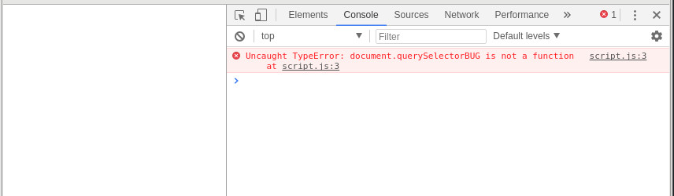

# Javascript

## Access to HTML DOM


### Basic code

* Consider the html webpage containing this element
```html
<div class="hello_world"></div>
```

This html page would lead to an empty page when viewed from the browser.

* Now create a file called `script.js`.
* Add the following JavaScript code in this file
```javascript
const element = document.querySelector(".hello_world");
element.textContent = "Hello World";
```
* Finally, add in the header of the html file the following tag.
```html
<script src="script.js" defer></script>
```
* Reload the webpage in the browser and check that the `Hello World` is now appearing.

### Explanation

Let first check at the JavaScript syntax
```javascript
const element = document.querySelector(".hello_world");
```

* `document` is a globally accessible variable that contains the DOM of the HTML webpage.
* `document.querySelector("X")` allows to query inside the DOM an element matching the provided selector. The syntax of the selector `X` is similar to CSS.
* `const element = document.querySelector(...)` defines a variable named `element`. `element` receives the value returned by `document.querySelector(...)`. Also, `element` is declared as `const` which means that `element` cannot be re-assigned in the future to another value (note that the data inside `element` can still be modified).

The second line
```javascript
element.textContent = "Hello World";
```
allows to modify the textual content of the DOM element stored in the variable `element`.

Finally, in the HTML file, the line
```html
<script src="script.js" defer></script>
```
enable to load the JavaScript file. The `defer` keyword indicates that the script should run once the HTML DOM element is loaded.
As a result, the HTML code is first parsed by the browser, and the DOM tree is built, before the script in `script.js` is executed.

### Loop

Add the following loop in the JavaScript
```javascript
for(var k=0; k<20; k++) {
	element.textContent += "Hello World ";
}
```

Note that it is possible to use JavaScript to automatize tasks such as in using loops to fill and generate content, while this was not possible in pure HTML and CSS description.

## Browser console

Let's consider that your JavaScript code contains a syntax error or bug. This error may result in a complete empty screen that can be hard to debug without extra information.

To help developers to debug and follow the execution of JavaScript code, modern browsers propose an embedded console where information and error can appear, similarly to standard console output in other languages.

* Modify the first line of your JavaScript code into the following erroneous one
```javascript
const element = document.querySelectorBUG(".hello_world");
```
* Observe that the resulting webpage is an empty one, without visible error information.
* Enter the _developer mode_ of your browser, usually with the shortkey `F12`. And select `Console`.
* Observe that the console is now indicating the source of the error, thus helping to debug.


More generally, you can use the command `console.log()`, which is similar to `print` statements of other languages.

* Consider the following code

```javascript
const element = document.querySelector(".hello_world");
element.textContent = "Hello World";

for(var k=0; k<20; k++) {
	console.log("k=",k);
	element.textContent += "Hello World ";
}

// any variable can be printed in console
console.log(element.textContent);
```
and observe the printed values in the console.


## DOM Elements

`textContent` is only one of the [several methods and properties](https://developer.mozilla.org/en-US/docs/Web/API/Element) that can be accessed from the DOM elements provided by `querySelector`.

__Q.__ Print in console the parent element of the selected one.

__Q.__ Change the color of the text element using [style property](https://developer.mozilla.org/en-US/docs/Web/API/HTMLElement/style).
Observe the HTML DOM hierarchy in the developer mode of the browser to see the addition of the style property.

__Q.__ Consider the following HTML code

```html
<div class="parent">
  <div class="child1"></div>
  <div class="child2"></div>
  <div class="child3">
    <div class="smallChild"></div>
  </div>
</div>
```

* In the JavaScript file: Get the `parent` element.
* From the parent element, list on the console the children using `children` property.
* How to access to `smallChild` from the `parent` element ?

__Q.__ Write a code walking through the children of a specific element, and alternates the background color of these children between gray and white every two elements.