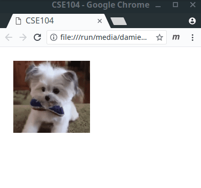

# Events

## Event programming principle 

Classical programming, consists usually to run a set of functions/procedure one after the other in a predictable way (procedural programming).
Let us consider that a program should interact with a user able for instance to click on a button, or more generally, to click on a specific element, leading to a response of the program. The instant and number of time that the user is clicking on the element are arbitrary and non predictable.
`Event programming` approach is usually used to handle these interaction. 

Event programming works with two elements: a `listener`, and a `action` function.
A `listener` is a function that is waiting a user event to take place. For instance, the fact that a click occurs on a specific element, or the displacement of the mouse (In more details, a listener may be implemented as a thread waiting a specific signal).
When the event takes place, the `listener` is activated and run a response `action` function. This `action` function should be defined by the user is order to adapt the behavior of the program to the event. This function is also called a `callback function` (a function, which is called by another one: here the listener).

## Handling events in JavaScript

Let us consider the following HTML and JavaScript code

```html
<h1>Click on me!</h1>
```

```javascript
const title = document.querySelector("h1");
title.addEventListener('click',actionClicked);

function actionClicked(event) {
  console.log('clicked');
}
```

Explanation of the line `title.addEventListener('click',actionClicked);` 
* [addEventListener](https://developer.mozilla.org/en-US/docs/Web/API/EventTarget/addEventListener) is a JavaScript function associating a listener and an action function to an element.
* In this case, the element `title` is associated to a listener that will wait an event of type `click`
* When the `click` event is received by the listener, the function `actionClicked` is called.

__Q.__ Run the associated code in your browser. Observes the console when you click several time on the title.

__Rem.__
* Javascript can handle several [types of event](https://developer.mozilla.org/en-US/docs/Web/Events).
* At the opposite of [addEventListener](https://developer.mozilla.org/en-US/docs/Web/API/EventTarget/addEventListener), [removeEventListener](https://developer.mozilla.org/en-US/docs/Web/API/EventTarget/removeEventListener) can remove existing listener associated to an element.
* You can find the syntax `title.onclick = actionClicked` which is also valid. However, only one event type can be associated to the element using this syntax, while the use of addEventListener can handle multiple event types if needed.

## DOM modification on events

It is possible to modify the DOM in response to events, for instance in adding new elements.

* Consider the following HTML and JavaScript code

```html
<article>
  <h1>Click on me!</h1>
</article>
```

```javascript
const title = document.querySelector('h1');
title.addEventListener('click',actionClicked);

function actionClicked(event) {
  // Create a new element
  const newElement = document.createElement('p');
  newElement.textContent = 'Clicked !';

  // Add new element in the DOM
  const article = document.querySelector('article');
  article.appendChild(newElement);
}
```

Note that new elements are added every time the user click on the title.

## CSS modification

Another possibility of interaction consists in modifying the CSS appearance of the element.

* Consider this example switching between pre-existing CSS classes

```html
<h1>Click on me!</h1>
<div class="square"></div>
```

```css
div {
  width: 200px;
  height: 200px;
}

.square {
  background-color: yellow;
}

.circle {
  background-color: red;
  border-radius: 50%;
}
```

```javascript
const title = document.querySelector('h1');
title.addEventListener('click',actionClicked);

function actionClicked(event) {
  const element = document.querySelector('div');
  element.classList.remove("square");
  element.classList.add("circle");
}
```

And observe the behavior when clicking on the title.

* Another option would be to describe all the possibilities in the HTML document (both square and circle), but only drawing one or the other dynamically.

```html
<h1>Click on me!</h1>

<div class="square"></div>
<div class="circle invisible"></div>
```

```css
div {
  width: 200px;
  height: 200px;
}

.square {
  background-color: yellow;
}

.circle {
  background-color: red;
  border-radius: 50%;
}

.invisible {
  display: none;
}
```

```javascript
const title = document.querySelector('h1');
title.addEventListener('click',actionClicked);

function actionClicked(event) {
  const circle    = document.querySelector('.circle');
  const square = document.querySelector('.square');

  square.classList.add("invisible");
  circle.classList.remove("invisible");
}
```    


## Exercice

* Re-create the behavior of this webpage where the image is switching when the user click on it.



__Hints in JavaScript.__

* `let x=0;` initialize a variable named x that can be re-assigned.
* `a%b` return the remainder of the integer division of a by b (modulus operator)
* Conditionnal in JavaScript can be coded using standard `if` statements
```javascript
if( condition ) {
  action ...
}
else {
  other action ...
}
```