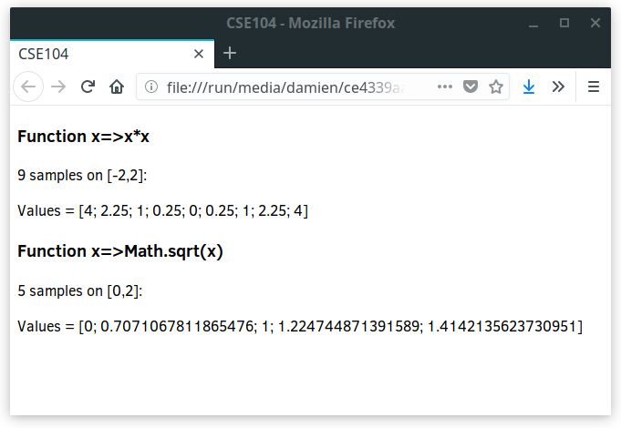
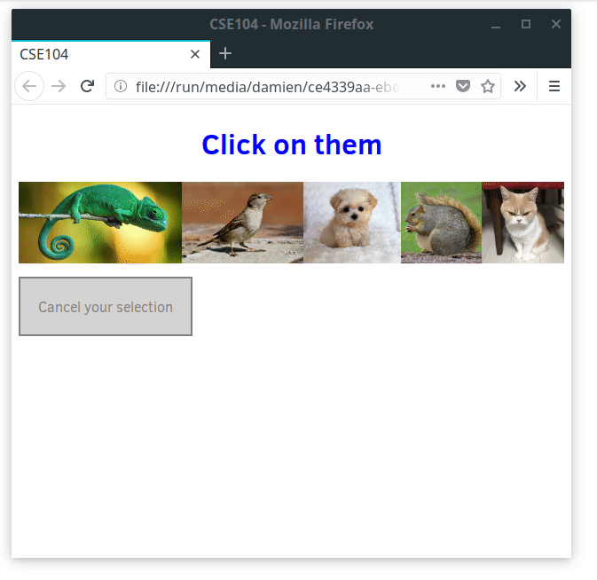

# JavaScript as a language


JavaScript, at the opposite of HTML and CSS, is a standard programming language able to automatize tasks. JavaScript is interpreted by the browser, which means that the browser parse and analyze directly the textual code, and then run it dynamically.
Javascript is thus an __interpreted__ language (like Python), at the opposite of compiled languages which are first transformed into byte code, later executed by the processor (like C, C++) or virtual machine (like Java).

## Declaration

The code in `examples/01_declaration` describes different ways of declaring variables.

* Run the code in your browser and observe the printed results in the console. Compare the printed results with the code in `script.js` file.

Note that semicolons at the end of the line may be omitted when there is no ambiguity. It is recommended to keep explicit semicolons after every statement.

### Use strict 

Note the first line `"use strict";`.
This line indicates that the JavaScript code conform to the more recent standard ([ECMAScript 6](http://es6-features.org)). Note that the recent standard is stricter than the old one, limiting odd behaviors and bad practices.

As good practice, you should always conform to the most recent standard, thus adding `"use strict";` and following this standard.

### Variable

Note the three ways of declaring variables in JavaScript: const, let, var.

`var` is the old way of declaring variables (very commonly found on examples code on internet), `const`/`let` are the new norm.

While explained in more details later, you should follow the following priority in declaring your variables:
1. Use `const` by default for your variable
1. If you need to re-assigned your variable, use `let`
1. If in some situation, you need a function-scop variable, use `var`

__Note__. As good practice to help code lisibility, your variables should have
* the shortest possible scope
* store only one value in its life-time if appropriate (especially avoid storing different types in the same variable).
* declared only when needed

## String

Run and observe the code from the second directory `examples/02_string`.

JavaScript [Strings](https://developer.mozilla.org/en-US/docs/Web/JavaScript/Reference/Global_Objects/String) can be defined using simple or double quotes. Starting by simple/double quote must however respectively be ended with the same type of quote.

Note that template literals are an efficient and readable way of mixing text with values.

## Conditionals and loops


Run and observe the code from the directory `examples/03_conditional_loop`. Note the influence of the scope delimited by `{ ... }` on the different type of variable declaration.

## Arrays

Run and observe the code from the directory `examples/04_array` for example of use of [JavaScript arrays](https://developer.mozilla.org/en-US/docs/Web/JavaScript/Reference/Global_Objects/Array).

Note that JavaScript arrays are naturally sparse container (actualy dictionary) that can handle non consecutive, and even negative indexing. Take care to don't confound with negative indexing in Python related to backward iteration.
Index of JavaScript array can simply be seen as a key of a dictionary.

You may use dedicated functions on arrays such as [find, slice, splice, fill, filter, concat, indexOf, etc](https://developer.mozilla.org/en-US/docs/Web/JavaScript/Reference/Global_Objects/Array).

## Dictionary

Every JavaScript object can be seen as a dictionary, i.e. a set of property/key and value.

Run and observe the code from the directory `examples/05_dictionary`.

## Function

Run and observe the code from the directory `examples/06_function`.

Note that JavaScript functions are treated a normal variables. Functions are stored text, and are dynamically interpreted when called.


## Exercises

__Q.__ Create a JavaScript function that computes the samples of an arbitrary function of one variable on a given interval.

The function will receive the following parameters:
* _func_: A function of one variable
* _a_: the starting parameter
* _b_: the ending parameter
* _n_: the number of samples

Your function will return an array containing the n samples of the function _func_ on the interval [a,b].

Print on the console the result of some function. 
Examples:
```javascript
console.log( sample( x=>x*x, -2, 2, 9 ) );
console.log( sample( x=>Math.sqrt(x), 0, 2, 5 ) );
```

_Note_: basic mathematical functions (sqrt, cos, sin, etc) can be accessed using the built-in object [`Math`](https://developer.mozilla.org/en-US/docs/Web/JavaScript/Reference/Global_Objects/Math) (ex. `Math.cos`).


__Q.__ Extend your program to show the result in your browser instead of the console.

For instance, create the function `showSample` such that the following lines

```javascript
showSample( x=>x*x, -2, 2, 9 );
showSample( x=>Math.sqrt(x), 0, 2, 5 );
```

result in this rendering in your browser


_Hint_: [join](https://developer.mozilla.org/en-US/docs/Web/JavaScript/Reference/Global_Objects/Array/join) allows to define the separator between elements of an array.

__Q.__ Create a program showing the history of the images which are clicked by the user (see image bellow, or [directly accessible code here](https://imagecomputing.net/damien.rohmer/teaching/2017_2018/semester_2/CSE_104/online_exercices/B_javascript/03_javascript_language/click_image/)):



* The images can be selected when the user click on them.
* Every time the user click on an image, the text describing the history of the selected images is updated.
* A possibility to cancel and erase the history of memory is proposed. The cancel button can be clicked only when there is an existing history to cancel.

__Note__: 
* You can select all elements satisfying a given selector using [`querySelectorAll`](https://developer.mozilla.org/en-US/docs/Web/API/Document/querySelectorAll).
* In the function triggered by the `click` event, the selected object can be accessed using the property [`currentTarget`](https://developer.mozilla.org/en-US/docs/Web/API/Event/currentTarget).
* The appearance should be described in the CSS file. You can switch appearance in adding/removing CSS class to elements from the JavaScript code. However, avoid setting explicit appearance (such as color, border, etc) in your JavaScript code.