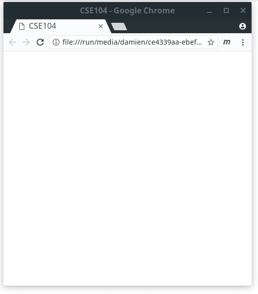
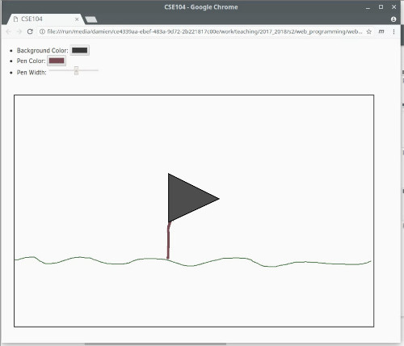

# Canvas

[Canvas](https://developer.mozilla.org/en-US/docs/Web/API/Canvas_API) element is a container used to draw bitmap graphics.
The [canvas API](https://developer.mozilla.org/en-US/docs/Web/API/Canvas_API/Tutorial/Drawing_shapes) provide basic primitive drawing such as rectangles, lines, arcs.


## Basic usage

* Create an HTML file containing a canvas tag `<canvas></canvas>`
* Consider the following JavaScript code and observe the resulting drawing on your screen.

```javascript
"use strict";

// Creation of the canvas
const canvasElement = document.querySelector('canvas');
const ctx = canvasElement.getContext('2d');

// Size of the canvas
ctx.canvas.width = 600;
ctx.canvas.height = 600;

// Draw some rectangles
ctx.fillStyle = 'lightgray';
ctx.fillRect(0,0,600,600);

ctx.fillStyle = 'green';
ctx.fillRect(50,50,250,400);

ctx.fillStyle = 'yellow';
ctx.fillRect(100,150,50,50);

// Draw some lines
ctx.lineWidth = 2;
ctx.strokeStyle = 'red';
ctx.moveTo(500,150);
ctx.lineTo(500,300);
ctx.lineTo(200,300);
ctx.lineTo(150,150);
ctx.stroke();

// Draw a circle
ctx.fillStyle = 'salmon';
ctx.beginPath();
ctx.arc(400,400,50,0,2*Math.PI);
ctx.fill();
```
* Change some parameters such as position and colors of the various shapes, add new shapes, and make sure you understand the role of each command line.

__Note:__
* The drawing is not called directly on the canvas, but on a [Rendering Context](https://developer.mozilla.org/en-US/docs/Web/API/RenderingContext) `ctx`.
* A Rendering Context can be seen as the method and environment needed to perform the rendering, i.e. how to fill the pixels of the image.
* JavaScript provide two possible context for canvas:
  * [CanvasRenderingContext2D](https://developer.mozilla.org/en-US/docs/Web/API/CanvasRenderingContext2D): the used in this case to draw 2D shapes.
  * [WebGLRenderingContext](https://developer.mozilla.org/en-US/docs/Web/API/WebGLRenderingContext) allowing to use the [WebGL API](https://developer.mozilla.org/en-US/docs/Web/API/WebGL_API) to draw 3D graphics. 
    * _So far, the use of WebGL will be outside of the scope of this class, but you may check [Three.js](https://threejs.org/): a simple to use library for 3D graphics using WebGL._


## Interaction with the user

Create a program allowing the user to draw on the window of your browser when pressing the mouse button as seen in the following example



__Hints:__
* You can use the following code to set the size of your canvas to fill the window of the browser.
```javascript
ctx.canvas.width = window.innerWidth;
ctx.canvas.height = window.innerHeight;
```
* You can consider a boolean _drawing state_ parameter in coordination with the action associated with `mousedown`, `mouseup`, and `mousemove` such that
  * `mousedown` activates the _drawing state_ of your program and start a new path at the current cursor position.
  * `mouseup` desactivates the _drawing state_ of your program.
  * `mousemove` generates a line to the current cursor position if you are in an activated _drawing state_.

## Interface

Add an interface to your webpage in order to be able to set the color and width of your drawing, as well as the background color.

[](pics/drawing_interface.webm)
